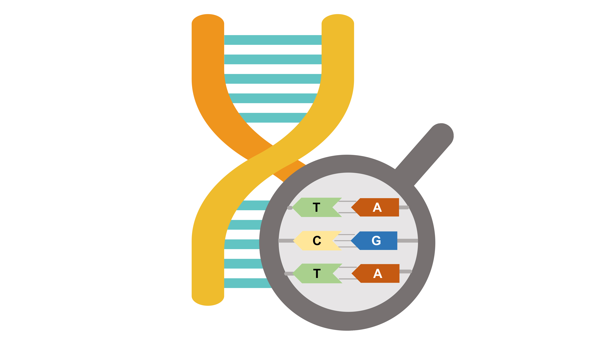

# quickGenome 


[English](README.md)
## Overview
quickGenome is an R package for the convenient accounting of genomic information and extraction of gene sequences. quickGenome can be used to calculate genome size, N50, contig count, GC content and other information, to detect chromosomal telomere positions, to calculate the number of gene exons, to calculate gene length distribution, to extract gene, mRNA, CDS and protein sequences based on GFF3 files.
The implementation of `quickGenome` function relies on `Biostrings` and `GenomicFeatures`.

## Installation
Before installing, you will need to download the `quickGenome` dependency package `Biostrings` and `GenomicFeatures` by `BiocManager`.

```{r}
if (!require("BiocManager"))
  install.packages("BiocManager")
library(BiocManager)
if (!require("Biostrings"))
  BiocManager::install("Biostrings")
if (!require("GenomicFeatures"))
  BiocManager::install("GenomicFeatures")
```
Install `devtools`, which is used to install R packages from GitHub.
```{r}
if (!require("devtools"))
  install.packages("devtools")
```
Once you have completed the above steps, start the installation.
```{r}
devtools::install_github("nongxinshengxin/quickGenome")
```
## Function
`quickGenome` has eleven **core functions**.
- **genome_basic_Info()**  Calculating basic genomic information, including size, GC content, N50 and so on.
- **find_telo()**  Identification of the location of telomeric repeat sequences at the ends of chromosomes.
- **binGC()**  The genomic sequence was split into multiple sliding windows of the same length and the GC content of each sliding window was calculated.
- **calculate_exonNum()** The number of gene exons was counted according to gff/gtf.
- **calculate_geneLength()**  The distribution of gene lengths was calculated from gff/gtf.
- **extract_gene()**  Extraction of gene sequences (including introns).
- **extract_mRNA()**  Extraction of mRNA sequences (exons only, not introns).
- **extract_CDS()**  Extraction of CDS sequences and protein sequences.
- **extract_upstream()**  Extraction of upstream sequences of genes.
- **extract_downstream()**  Extraction of downstream sequences of genes.
- **extract_fasta()**  Extracts sequences from fasta files based on sequence names.

## Application
### genome_basic_Info
This function will print the genome information to the window. The function has only one argument, filepath, which requires a string containing the path to the fasta file. In addition to the fasta file, its gzip archive, fasta.gz, can also be read.

```{r}
genome_basic_Info(filepath = "TAIR10_chr_all.fasta")

# [1] "The size of genome is 119668634"
# [1] "The number of contig/scaffold/chromosome is 7"
# [1] "The size of largest contig/scaffold/chromosome is 30427671"
# [1] "GC content is 0.359998828097261"
# [1] "N50 is 23459830"
# [1] "L50 is 3"
# [1] "N90 is 18585056"
# [1] "L90 is 5"
```
### find_telo
This function returns a data frame with the positions of the telomeric repeats on both chromosomes 5' and 3'. The function takes four parameters: filepath, telo, threshold, minRepeatNum. filepath is the same as the genome_basic_Info() function; telo is followed by a string which is the telomeric sequence, defaulting to "CCCTAA" (or " TTAGGG"); the threshold parameter is followed by an integer that defines the distance from the end of the chromosome, the default is 1000 bp; the minRepeatNum parameter is followed by an integer that indicates the number of times the telomeric sequence is repeated.

```{}
find_telo(filepath = "TAIR10_chr_all.fasta",telo = "CCCTAA",threshold = 1000000,minRepeatNum = 2)

#    chr   length   left    right
# 1 Chr1 30427671 686949 29730288
# 2 Chr2 19698289     NA 19434111
# 3 Chr3 23459830 604863 23284456
# 4 Chr4 18585056  18180 18464255
# 5 Chr5 26975502 680342 26569632
# 6 ChrC   154478     NA       NA
# 7 ChrM   367808     NA       NA

```

### binGC
This function will return a data frame including the GC content of each sliding window. The function includes two parameters: filepath and bin. filepath parameter is the same as the genome_basic_Info() function; the bin parameter needs to be followed by an integer indicating the length of the sliding window, the default is 10000 bp.

```{}
binGC(filepath = "TAIR10_chr_all.fasta", bin = 10000)

#     Name   Start     End     GC
# 1   Chr1       1   10000 0.3401
# 2   Chr1   10001   20000 0.3063
# 3   Chr1   20001   30000 0.3787
# 4   Chr1   30001   40000 0.3715
# 5   Chr1   40001   50000 0.3474
# 6   Chr1   50001   60000 0.3731
# 7   Chr1   60001   70000  0.339
# 8   Chr1   70001   80000 0.3687
# 9   Chr1   80001   90000  0.347
# 10  Chr1   90001  100000 0.3909
# 11  Chr1  100001  110000 0.3461
# ................
```

### calculate_exonNum
This function returns a data frame containing the number of genes with different numbers of exons. The function takes three parameters: filepath, format, collapse. filepath takes a string containing the path to the gff file or gtf file; format takes the string "gtf" or " gff" (default), indicating the format of the input file; collapse is followed by TRUE or FALSE (default), if TRUE, genes with more than 10 exons will be collapsed together and counted.

```{}
## collapse = FALSE
calculate_exonNum(filepath = "TAIR10_GFF3_genes.gff",format = "gff",collapse = FALSE)

#    exon.num Freq
# 1         1 8153
# 2         2 5168
# 3         3 4012
# 4         4 3284
# 5         5 2939
# 6         6 2347
# 7         7 2088
# 8         8 1597
# 9         9 1521
# 10       10 1260
# 11       11  916
# 12       12  882
# 13       13  732
# 14       14  596
# 15       15  385
# 16       16  297
# 17       17  232
# 18       18  233
# 19       19  192
# 20       20  169
# 21       21  114
# 22       22   98
# 23       23  100
# 24       24   68
# 25       25   50
# 26       26   50
# 27       27   40
# 28       28   35
# 29       29   23
# 30       30   17
# 31       31   21
# 32       32   21
# 33       33   13
# 34       34   12
# 35       35   13
# 36       36    3
# 37       37    7
# 38       38    8
# 39       39    7
# 40       40    7
# 41       41    5
# 42       42    8
# 43       43    4
# 44       44    3
# 45       45    1
# 46       46    3
# 47       48    5
# 48       49    6
# 49       50    3
# 50       51    1
# 51       53    1
# 52       56    2
# 53       60    1
# 54       61    1
# 55       65    2
# 56       66    1
# 57       67    1
# 58       75    1
# 59       79    1


## collapse = TRUE
calculate_exonNum(filepath = "TAIR10_GFF3_genes.gff",format = "gff",collapse = TRUE)

#    exon.num Freq
# 1         1 8153
# 2         2 5168
# 3         3 4012
# 4         4 3284
# 5         5 2939
# 6         6 2347
# 7         7 2088
# 8         8 1597
# 9         9 1521
# 10       10 1260
# 11      >10 5391
```

### calculate_geneLength
This function returns a data frame containing the distribution of gene (or transcript) lengths under a sliding window. The function takes five parameters: filepath, format, type, bin, threshold. filepath and format are the same as the calculate_exonNum() function; the type parameter is followed by the string "transcripts " or "genes" (the default), indicating whether the gene length or transcript length is being calculated; the bin parameter is followed by an integer indicating the length of the sliding window, the default being 500; the threshold parameter is followed by an integer indicating that genes exceeding the threshold length are collapsed are folded together and counted. The default is 4000 bp.

```{}
calculate_geneLength(filepath = "test.gff",format = "gff", type = "genes",bin = 500,threshold = 4000)

#       range number
# 1     1-500    783
# 2  501-1000   2262
# 3 1001-1500   2799
# 4 1501-2000   2231
# 5 2001-2500   1132
# 6 2501-3000    645
# 7 3001-3500    398
# 8 3501-4000    259
# 9    > 4000    518
```

### extract_gene
The function consists of three parameters: fasta, gff, outputfile. fasta takes a string containing the path to the fasta file; gff takes a string containing the path to the gff file, note that currently **only gff3 format** is supported; outputfile takes a string containing the path to the output file The outputfile parameter should be a string containing the path to the output file, which is a fasta file.

```{}
extract_gene(fasta = "test.fasta",gff = "test.gff",outputfile = "genes.fasta")
```

### extract_mRNA
Same arguments as extract_gene() function.

```{}
extract_mRNA(fasta = "test.fasta",gff = "test.gff",outputfile = "mRNAs.fasta")
```

### extract_upstream
This function takes four parameters: fasta, gff, outputfile, range. the first three parameters are the same as extract_gene(); the range parameter takes an integer representing the length of the extracted upstream sequence, default 2000 bp.

```{}
extract_upstream(fasta = "test.fasta",gff = "test.gff",outputfile = "upstream.fasta",range=2000)
```

### extract_downstream
This function takes four parameters: fasta, gff, outputfile, range. the first three parameters are the same as extract_gene(); the range parameter takes an integer representing the length of the extracted downstream sequence, default 2000 bp.

```{}
extract_downstream(fasta = "test.fasta",gff = "test.gff",outputfile = "downstream.fasta",range=2000)
```

### extract_CDS
This function takes five parameters: fasta, gff, outputfile, translation, if.fuzzy.codon. The first three parameters are the same as extract_gene(); the translation parameter is followed by TRUE or FALSE (the default), if TRUE, the CDS sequence will be translated into a protein sequence. if.fuzzy.codon parameter means how fuzzy codons (i.e codon with IUPAC ambiguities) should be handled. Accepted values are: "error": An error will be raised on the first occurence of a fuzzy codon. This is the default. "solve": Fuzzy codons that can be translated non ambiguously to an amino acid or to * (stop codon) will be translated. Ambiguous fuzzy codons will be translated to X. "error.if.X": Fuzzy codons that can be translated non ambiguously to an amino acid or to * (stop codon) will be translated. An error will be raised on the first occurence of an ambiguous fuzzy codon. "X": All fuzzy codons (ambiguous and non-ambiguous) will be translated to X.

Note: If a value other than "error" is accepted, the function will be slowed down considerably.

```{}
#translation=FALSE
extract_CDS(fasta = "test.fasta",gff = "test.gff",outputfile = "CDS.fasta",translation = FALSE, if.fuzzy.codon="error")
```


```{}
#translation=TRUE
extract_CDS(fasta = "test.fasta",gff = "test.gff",outputfile = "pep.fasta",translation = FALSE, if.fuzzy.codon="error")
```

### extract_fasta
This function contains five parameters fasta, genelist, outputfile, Negate, Str. fasta and outputfile parameters are the same as extract_gene(); genelist parameter requires a string containing the path of the file with the list of gene names (or other sequence names); Negate parameter is followed by TRUE or FALSE (the default), if TRUE, all sequences except those contained in the genelist file will be extracted; Str is followed by TRUE or FALSE (the default), if TRUE, the genelist parameter requires a string containing a sequence name, or a vector of strings containing multiple sequence names.

```{}
##Str=TRUE 
extract_fasta(fasta = "test.fasta",genelist = c("Chr1","Chr2"),outputfile = "list.fasta",Negate = FALSE,Str = TRUE)

##Str=FALSE
extract_fasta(fasta = "test.fasta",genelist = "list.txt",outputfile = "list.fasta",Negate = FALSE,Str = FALSE)
```

```{}
##Negate = TRUE Str=TRUE
extract_fasta(fasta = "test.fasta",genelist = c("Chr1","Chr2"),outputfile = "Negatelist.fasta",Negate = FALSE,Str = TRUE)
```


## Reference
Biostrings https://doi.org/doi:10.18129/B9.bioc.Biostrings

GenomicFeatures https://doi.org/doi:10.18129/B9.bioc.GenomicFeatures

## Documentation
The English documentation is available in - https://github.com/nongxinshengxin/quickGenome

The Chinese documentation is available in - 微信公众号农心生信工作室

## Citation
Please, when using `quickGenome`, cite us using the reference: https://github.com/nongxinshengxin/quickGenome

## Contact us
- Email: nongxinshengxin@163.com
- Wechat Official Account：

